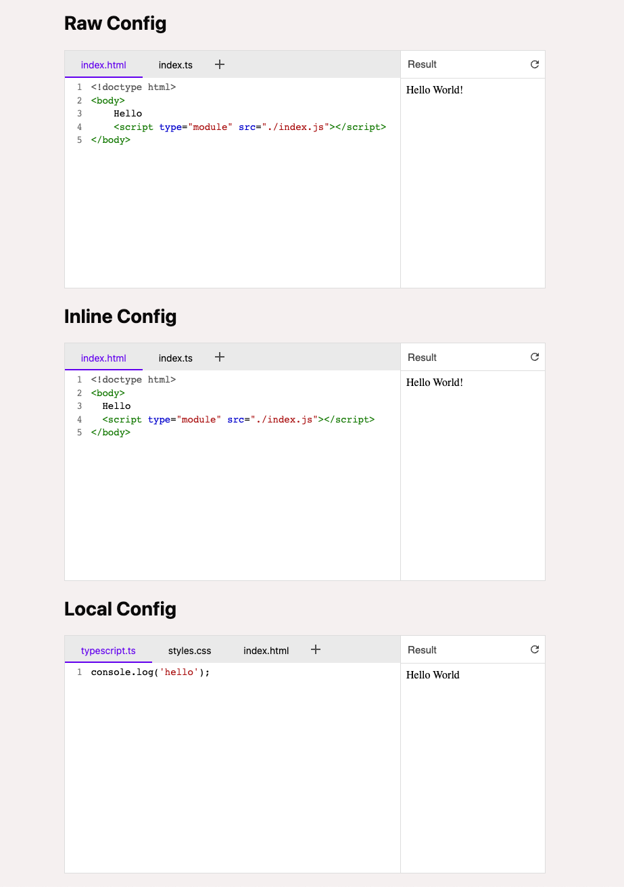

# Astro + playground-elements

Example of how to use Astro to bundle the [playground-elements](https://github.com/google/playground-elements) playground client side.

This also applies to [Vite](https://vitejs.dev/).



## Usage

```astro
---
const rawConfig = `<script type="sample/html" filename="index.html">
<!doctype html>
<body>
    Hello
    <script type="module" src="./index.js">&lt;/script>
</body>
</script>

<script type="sample/ts" filename="index.ts">
    document.body.appendChild(document.createTextNode("World!"))
</script>`;
---

<h2>Raw Config</h2>

<playground-ide editable-file-system line-numbers resizable set:html={rawConfig}></playground-ide>

<h2>Inline Config</h2>

<playground-ide editable-file-system line-numbers resizable is:raw>
    <script type="sample/html" filename="index.html">
    <!doctype html>
    <body>
      Hello
      <script type="module" src="./index.js">&lt;/script>
    </body>
  </script>

    <script type="sample/ts" filename="index.ts">
    document.body.appendChild(document.createTextNode("World!"))
  </script>
</playground-ide>

<h2>Local Config</h2>

<playground-ide editable-file-system line-numbers resizable project-src="playground.json"></playground-ide>

<script>
    import 'playground-elements/playground-ide.js';
</script>
```

# Known Issues

- [ ] Playground typescript worker not loading during development
